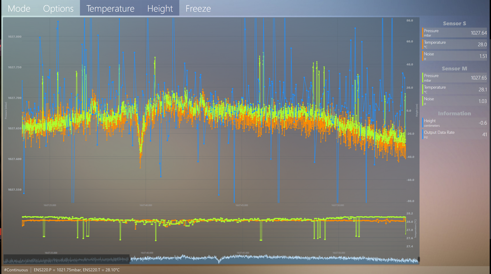
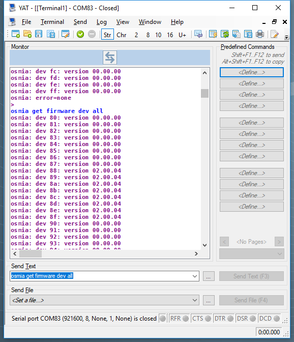
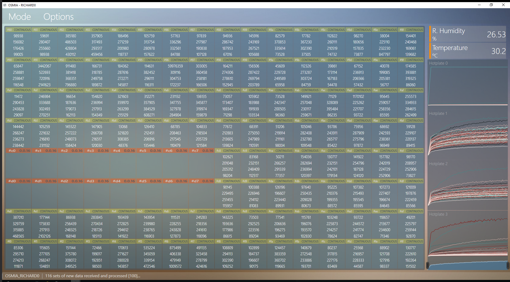
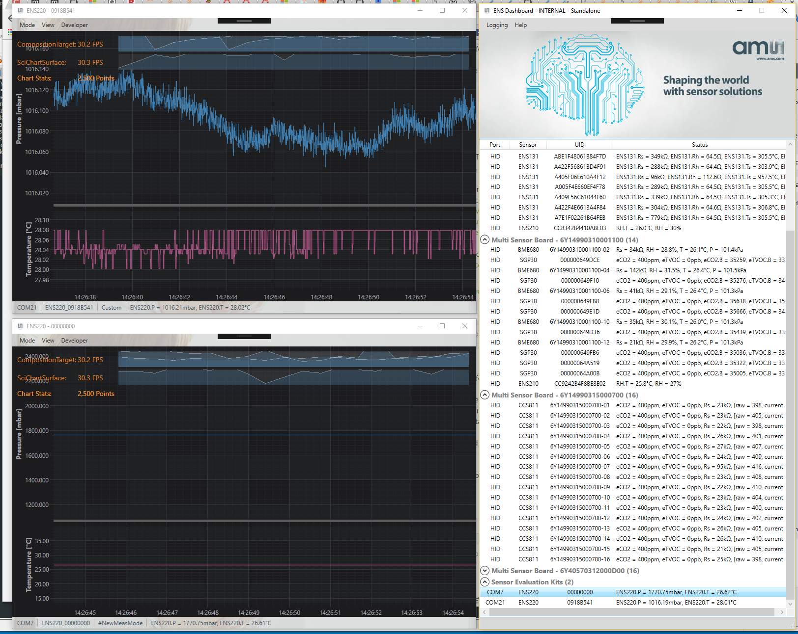
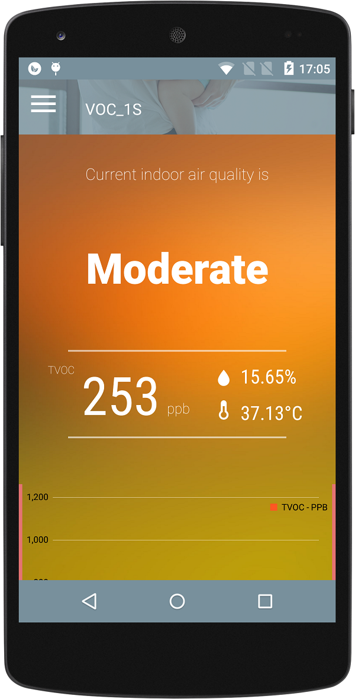
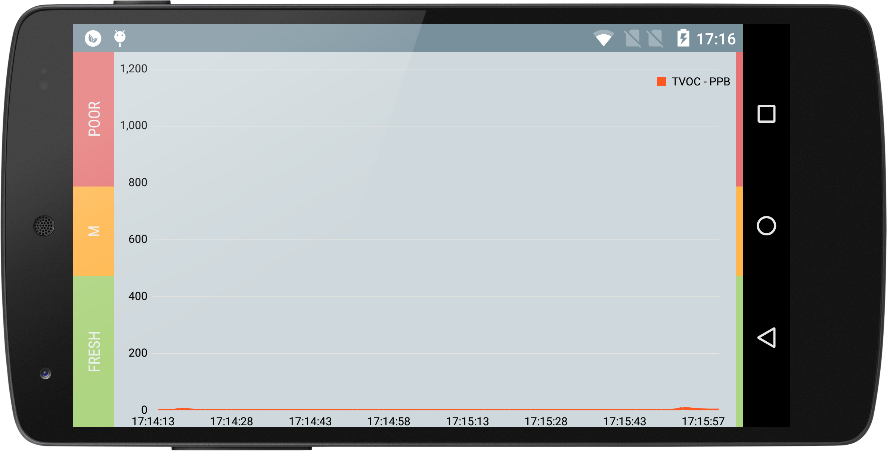

# Project References
The following shows some of project reference materials available in the public domain (if you know the right place or keyword to find them).

## Library and API Document

This is an indoor air quality software library for CCS801 gas sensor device. The library contains algorithm to convert raw signals from CCS801 analog sensor to indication levels of indoor air quality in equivalent CO2/TVOC. 

Document and library download: <https://ams.com/ccs801> -> `Tools & Support`

## The Dashboard (Windows)

The Dashboard is a Windows application supports data monitoring and logging of sensor measurements. It communicates with SPI/I2C sensor devices to perform raw (register) level communication and special hidden operation modes over USB-CDC/HID.

The Dashboard supports over 30+ environmental sensor devices: in-development, production and third-party.

The Dashboard can support up to 200Hz (data acquisition and logging are only limited by the physical comm speed and sensor measurement rate of above 500Hz) of graph data refresh and update. This allows demonstration of high sampling frequency sensor devices.

All publicly available evaluation kits, internal development platforms and customer specific kits are supported by the Dashboard. Not only the Dashboard software is a convenient one stop solution for end user sensor product evaluation, but also because of its high performance, reliability and user-friendly interface, it is intensively used by the internal product development teams to perform measurement and testing for characterisation and algorithm development, trade show demos, etc.

Only publicly available features are documented in the user manual. Both software and user manual are available via the product website: <https://ams.com/ensdashboard>.

## Multi-Sensor Evaluation Platform O

An ARM Cortex-M4 based bridge board, with up to 10 independent SPI/I2C channels, multiplexed with additional GPIOs, to support a detachable multi-sensor board with over 128 SPI/I2C sensor devices, soldered or socket mounted.

The bridge board, running FreeRTOS, handles communications between the host system and sensor devices on multi-sensor board. The host system interfaces with the bridge board via virtual COMM/CDC protocol over high speed USB connection (480Mbps).

The bridge board, when instructed by the host system, is able to perform simple tasks without the host system being awake or connected all the time. This simplifies communication sequence and reduces latency between host applications and sensor devices when high frequency measurement and communication are required.

The communication protocol is ASCII command line based and multiplexed, hence one or more sensor devices can be targeted independently or collectively.

A public version of stripped down bridge board and documented communication interface is also available as a **USB-I2C evaluation kit bridge dongle**: <https://ams.com/usbi2c>.

Host applications can communicate with any sensor device at register map or feature wrapped (e.g. special operation modes, firmware upgrade) levels.

The platform is also fully integrated in the **Dashboard**. The following screenshot shows real-time 20Hz of measurement data (read, processed, displayed, graphed and logged) from over 128 independently running sensors:  

## Multi-Sensor Evaluation Platform I

A Microchip/Atmel XMEGA based bridge board, with up to 3 independent I2C channels, multiplexed with additional GPIOs and I2C expanders, to support connecting to a detachable multi-sensor board with over 64 I2C sensor devices, soldered or socket mounted.

The bridge board, running non-OS busy looped, and with common driver support of ASF 3.x framework, handles communications between host systems and sensor devices on multi-sensor board. Host systems interface with the bridge board via full speed USB-HID connection (12Mbps).

The bridge board, when instructed by host systems, is able to perform simple tasks without the host system being awake or connected all the time. This simplifies communication sequence and reduces latency between host applications and sensor devices.

The communication protocol is multiplexed over standard 64-byte HID packets, hence one or more sensor devices can be targeted at a given instruction.

Despites all sensor device communications are handles via the bridge board, each of the sensor device are exposed to the host systems as they were connected via an independent communicate interface. This is an optional bridge operation mode in addition to the normal bridge operation mode as seen in [**Multi-Sensor Evaluation Platform O**](#multi-sensor-evaluation-platform-o).

Host application can communicate with any sensor device at register map or feature wrapped (e.g. special operation modes, firmware upgrade) levels.

The platform is also fully integrated in the **Dashboard**. The following screenshot shows multiple sensor boards (with 16 sensor devices connected on each board) running measurement (raw data read, processed, displayed):

## The Dashboard (Android)

A mobile stripped down version of the Dashboard software running on Android smartphones to support production sensor devices (e.g. CCS801, CCS811) (via USB or I2C on custom smartphones).

## Breathalyser (Android)

The following document provides an overview of an user demo application with algorithm implemented to showcase the performance of CCS803 (obsoleted) sensor. CCS803 was an analog sensor to detect ethanol concentration changes in breathalyser applications.

PDF: [raw/CCS_Breathalyser.pdf](raw/CCS_Breathalyser.pdf)

## Luxgen Auqa+

This is an Android mobile application, mainly written in C#, developed using Unity3D engine.

The application has an aquarium themed frontend, with CAN message receiver/handler (implemented as Android foreground service). Aquarium frontend elements animate different indications and messages received via CAN bus such as seatbelt, fuel/fan levels, etc. This is part of the informatainment system as an optional options available to early Luxgen SUV models.

Google/Youtube keywords: `Luxgen Aqua+`

(end)
